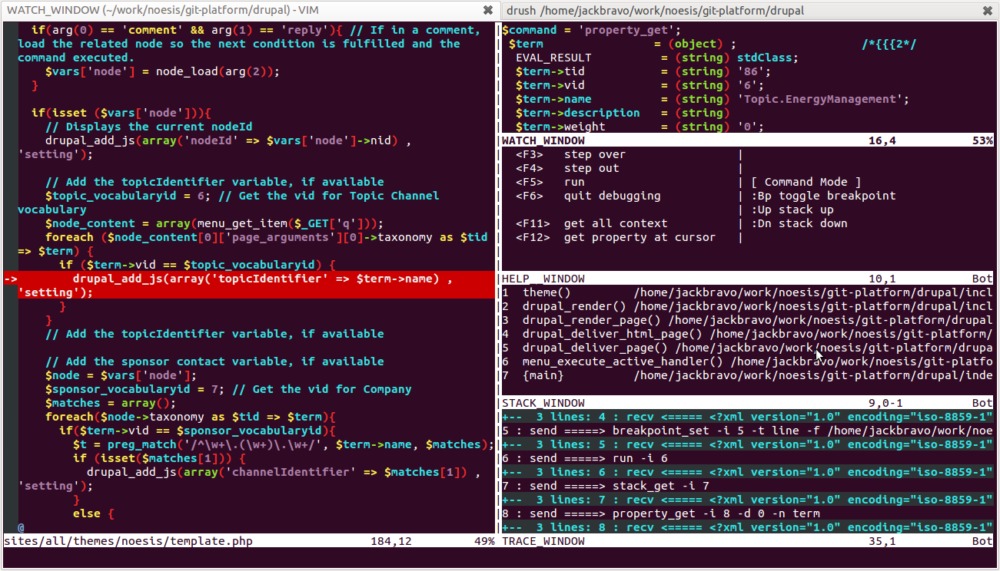

UPDATE: cambié el plugin de vim que se utiliza para debuguear por uno más nuevo mantenido en github.

El día de hoy estuve probando varios IDEs para PHP, porque quería debuguear un script con XDebug en lugar de utilizando echos, krumos y exits. Es decir, me quería ver más fresón. Y me daba flojera utilizar emacs que es lo que antes he descrito que puedes utilizar para [debuguear PHP](http://joaquin.axai.mx/debuguear-php-con-emacs-xdebug-y-geben). Así que me bajé y probé:

- [NetBeans](http://netbeans.org/kb/docs/php/debugging.html). El más lento de los 3.
- [PHPStorm](http://www.jetbrains.com/phpstorm/). El más fácil de configurar pero con la interfáz más rara.
- [Eclipse](http://devzone.zend.com/1147/debugging-php-applications-with-xdebug/). El más difícil de configurar, por mucho.

Debo decir, que fue sumamente penoso y laborioso. Configurar cada uno de estos programas tiene su chiste, en especial eclipse fue un PAIN IN THE ASS. PHPStorm y NetBeans fueron más sencillos, pero vaya, que feas son los programas de java. Además de lentos. __Lo peor de todos estos programas es configurar cada proyecto que quieres debuguear__. Cuando debugueas con emacs y con vim simplemente lanzas el debugger y listo, abre cada archivo que vas necesitando sin tanta faramalla, así sean archivos de distintos proyectos (__como cuando usas drush con tu proyecto de drupal__). Así que al final desistí de estos _"IDEs modernos"_ y regresé a vim.

Debo decir que debuguear con vim ha sido muy placentero. Entonces, vamos a los pasos para instalar:

1. Instalar XDebug. Hoy en día si usas ubuntu esto es de lo más sencillo: `sudo apt-get install php5-xdebug`. Si usas otro sistema operativo, buena suerte, seguro hay más tutoriales en google =). También recuerda aumentar el [timeout the php-fpm](http://www.command-tab.com/2011/06/20/true-php-debugging-with-nginx-and-php-fpm/). En nginx esto es con `fastcgi_read_timeout 600;`
2. Configurar xdebug para que acepte conexiones remotas poniendo esta línea en tu php.ini o en el caso de ubuntu la puedes poner en /etc/php5/conf.d/xdebug.ini: `xdebug.remote_enable=on`
3. Instalar el [cliente de XDebug para vim](https://github.com/ludovicPelle/vim-xdebug). Que simplemente lo bajas y pones archivos debugger.vim y debugger.py en tu carpeta .vim/plugin

Y listo, cuando quieres debuguear simplemente preparas vim con F5 para que esté esperando conexiones de XDebug en el puerto 9000. Tienes entonces 5 segundos para lanzar tu script en la consola o entrar a la página de PHP que quieres debuguear. Si lo haces desde el explorador simplemente es cuestion de agregar `?XDEBUG_SESSION_START=1` al final de tu ruta o instalar la extensión de firefox de [easy Xdebug](https://addons.mozilla.org/en-US/firefox/addon/easy-xdebug/) para no tener que escribir esto sino simplemente apretar un boton para cuando quieras debuguear.

El debugger de vim tiene los shortcuts en una de sus ventanas así que es muy sencillo de aprender. Los breakpoints funcionan muy bien, e inspeccionar variables también, así que no hay excusas para no usar xdebug ahora.

Si estas usando xdebug con fpm o fastcgi en el puerto 9001 (como describo en un [post anterior](http://joaquin.axai.mx/debuguear-php-con-emacs-xdebug-y-geben)), entonces necesitas configurar el plugin de vim para escuchar este puerto poniendo esta línea en tu .vimrc:

    let g:debuggerPort = 9001

Saludos!