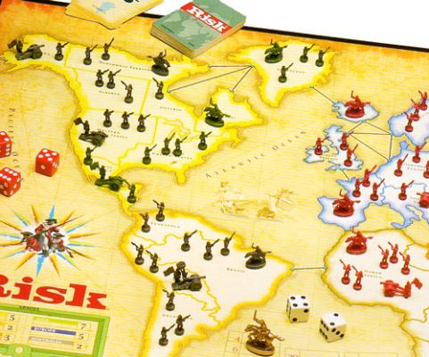

Vengo de la peor partida de [Risk](http://es.wikipedia.org/wiki/Risk) que he jugado en la vida. Con decir que en mi último intento de ataque perdí más de 15 tropas mientras a mi rival le quité sólamente 6. Fuí el primero en salir y aunque al final al menos me divertí mientras todos gritaban en mi última batalla, la verdad uno no puede quedar satisfecho después de semejante paliza.

Quiero por lo menos encontrar y sacar alguna enseñanza que venga de esa masacre. Supongo que en el risk, como en la vida, tienes días de buena suerte y mala suerte. Todos sabemos que la suerte puede cambiar en cualquier momento, pero si estás en un momento débil, y te encuentras con que la suerte no está de tu lado, hay que recordar que si quieres seguir en el juego tienes que ser muy disciplinado, escoger cuidadosamente cada batalla, e incluso a veces pasar algunos turnos esperando tiempos mejores. Ya que es en esos momentos cuando es más fácil que en unos cuantos tiros del dado quedes completamente aniquilado.
